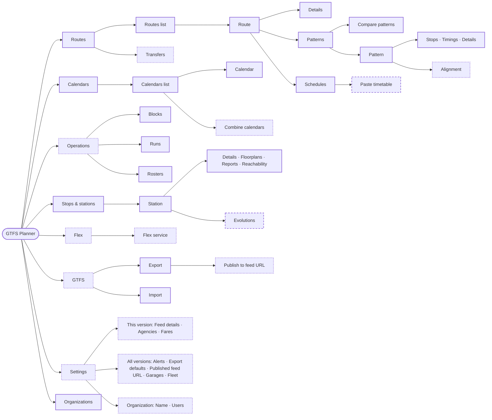

# Information Architecture

This document records where each screen and task lives in GTFS Planner. It covers pages on `main`,
pages that planned work adds, and agreed placements for requirement gaps that have no implementation
yet. It was written on 2026-09-27 against `main` at `7b583129` and updated for route schedules
(#698) and garages and fleet (#697), which merged the same day. A header review later that day
combined Import and Export under a GTFS pill and moved Settings into the account menu.

Planned and proposed items are placement decisions, not shipped behavior. Each carries one of these
statuses:

| Status | Meaning |
|---|---|
| **Live** | On `main` |
| **Planned** | Designed in planned work that has not merged |
| **Proposed** | Placement agreed; no design or implementation yet |

## Placement rules

These rules decided every placement below. Use them for new features.

1. **Frequency sets prominence.** Daily editing tasks get a top-level destination. Configuration
   and reference data that change a few times a year go under Settings, even when they are GTFS
   data (agencies, fares).
2. **The object that owns the data hosts its editor.** The pattern owns the stop sequence, so
   alignment, headsign defaults and boarding overrides live on the pattern. Only two trips on the
   same vehicle can offer an in-seat transfer, so that toggle lives on the block.
3. **Controls sit where their effect is visible.** Deadhead and relief settings stay on Blocks,
   where changing them redraws the blocks. Publishing happens on an export run, next to its
   validation results.
4. **Scope is always labelled.** A page is scoped to *this version*, *all versions* or the
   *organization*. The version switcher changes only version-scoped pages, and Settings groups its
   sections by scope.
5. **Derive instead of store when data follows from other data.** Flex areas and flex trips are
   generated at export from routes and stops, as deadheads are from blocks. Derived data cannot
   drift from its source.

## Top level

```
Pathways Studio   Alerts · Routes · Calendars · Operations · Stops & stations · Flex · GTFS
Org name                                        [Version ▾]   [Initials ▾]
                                                                ├ Org name: Settings
                                                                └ Account settings · Log out
```

| Destination | Holds | Scope | Status |
|---|---|---|---|
| Home (`/`) | Organization tasks for the signed-in user | Organization | Live |
| Alerts | Saved service alerts for the version, tabbed Current, Upcoming, In progress, Past | This version | Live |
| Routes | Route catalog, transfers, route and pattern pages | This version | Live |
| Calendars | Service calendars | This version | Live |
| Operations | Blocks · Runs · Rosters | This version | Live; grouping Proposed |
| Stops & stations | Stops, stations, floorplans, reports, closures | This version | Live |
| Flex | On-demand services layered on routes | This version | Proposed |
| GTFS | Export (default tab): export runs, validation, publishing. Import: creates a new version from GTFS files | Export: this version. Import: organization | Live; GTFS grouping Proposed |
| Settings | Rarely changed configuration and reference data, opened from the account menu | Labelled per section | Proposed |
| Organizations | Tenant management | System | Live, system administrators only |
| Account menu | Initials avatar; Settings under the organization name, then Account settings and Log out | User | Live; Settings entry and initials Proposed |

**Proposed nav changes.**
- Import and Export share one **GTFS** pill. Export is its default tab and Import its second tab,
  and each tab states what it acts on.
- Settings is the first item in the account menu, under the organization name. It has no place in
  the bar.
- The org-admin **Users** pill moves into Settings › Organization.
- Operations replaces the separate Blocks and Rosters pills that the planned blocking and roster
  work describes.
- Organizations, for system administrators, follows the task areas after a divider.

**Header presentation.** The header follows the TransitOps application design system's Top
navigation pattern. The product name sits above the organization name, task areas are text labels
without icons, and the current area has a filled selection tint. The version menu lists versions
before Rename version. The account menu trigger shows the user's initials, taken from the part of
the email before the @: `dana@` shows D and `alex.kim@` shows AK. Users have no name field.
Pages below the header keep their current styles until a separate decision on the rest of the
app.

## Sitemap

Solid borders are Live, dashed are Planned, and dotted are Proposed.



## Areas

### Routes

```
Routes                              /gtfs/:version/routes
├── Routes (list)                   Live
├── Transfers (list)                Live
└── Route                           /routes/:route_id
    ├── Details                     Live (read-only) → Proposed (editable)
    ├── Patterns                    Live
    │   ├── Compare patterns        Live      /routes/:route_id/patterns/compare?a=…&b=…
    │   └── Pattern                 Live      Stops · Timings · Alignment (Proposed) · Details
    └── Schedules                   Live (#698)
        └── Paste timetable         Planned
```

**Routes list** (Live): search; type, agency and Active/Inactive filters; sortable columns; route
badges; New route drawer.
- *Proposed:* when the version has no agency, which is the case for the blank version created with
  a new organization, the empty state and the New route drawer ask for agency name, website and
  timezone before the first route. Imported versions take their agency from `agency.txt`.

**Routes › Transfers** (Live): a list for the whole version, beside the Routes list.
- Columns: From, To, Type, Min time. Filters for type, stop and route, plus search.
- "New transfer" asks for the scope first (stop pair, route pair or trip pair), then shows only
  that scope's fields.
- It lives with routes because `transfers.txt` is only in the full GTFS export.
- In-seat transfers (types 4 and 5) appear behind an "In-seat (N)" filter, read-only, and are
  managed on Blocks. The default list shows general transfers (types 0–3). Where agencies use
  in-seat rows they are often most of the file: 72% of MBTA's transfers, and all of SEPTA rail's.

**Route › Details** (Proposed editable): an in-place form, like Pattern › Details.
- The route name and badge in the page header are the live preview while editing colors.
- A duplicate short name gets an inline, non-blocking warning under the field.
- Rarely used fields go under "Additional details": sort order, continuous pickup/drop-off (the
  route default), network and URL.
- Agency select, required when the version has more than one agency.
- A "Status and removal" section:
  - **Deactivate route** is reversible. It hides the route from export and keeps its data.
  - **Delete route** needs a confirmation naming the patterns and trips removed with it.
- Shows "Transfers here (N)", linking to Transfers filtered to this route, and "On-demand:
  <service>" when a flex service covers the route.

**Route › Patterns** (Live, with proposed additions):
- A **Generate missing alignments** bulk action, and a missing-segment count on each pattern row.
- A headsign count on each pattern row ("All N trips" or "M trips differ"), warning only when
  likely typos exist.

**Route › Patterns › Compare patterns** (Live): select two patterns, then open a full-width page
under the route. The Patterns tab stays current.
- **Two patterns** aligns the pair stop by stop, with added, removed and moved stops marked by
  symbol and text.
- **All patterns** shows every pattern of one direction as a stop-by-pattern overview.
- Trip counts for the calendar filter and running-time differences for each shared segment.
- A linked map draws both paths, marks the stops only one of the pair calls at, and follows the
  selected row.
- The picker can include a pattern from another route.

**Pattern** tabs:
- **Stops** (Live): the ordered stop visits. Loops are supported: A → B → A is valid, and only the
  same stop twice in a row is rejected.
- **Timings** (Live), with proposed additions:
  - A **Fill times between timepoints** action that estimates in-between times using the method
    chosen in Settings › Export defaults. Estimates are marked and can be edited before saving.
  - The per-stop "Boarding & headsign" disclosure gains continuous pickup and drop-off overrides
    with a "Same for all timings" option.
  - Each timing's headsign shows its usage line (see Details).
- **Alignment** (Proposed): a map of stop-to-stop segments marked saved, missing or unsaved.
  - Generate a segment along streets, or draw and edit points: add, move, delete, multi-select,
    simplify, clear.
  - Segments are stored by stop pair and shared. Editing a shared segment asks "This pattern
    only" or "All N patterns".
  - Segments follow the stop-visit order, so a loop's second pass is its own segment. Alignment
    export sets `shape_dist_traveled`.
- **Details** (Live), with a proposed addition next to "Headsign for new trips":
  - The line "Used by N trips · M use a different headsign", with **Review trips**.
  - Changing the headsign shows an inline "Also update N trips" box, checked by default, so the
    trips that follow the default get the new value when you save.
  - **Review trips** opens one drawer with two modes: change mode ("Trips the new headsign
    reaches") preselects the trips that show the old value and hands the selection back to the
    page, and exceptions mode ("Trips with a different headsign") preselects nothing and applies
    immediately.
  - Trips that differ keep their own headsign — for example an interlined trip that continues
    from another route.
  - There is no separate list of headsigns across the version. A headsign belongs to trips and
    defaults from the timing, then the pattern.

**Route › Schedules** (Live since #698, extended by advanced trip editing; Paste timetable Planned):
- A calendar and direction picker, with one timetable section per pattern.
- Add, edit, duplicate and delete trips, plus bulk delete.
- Planning summaries and **Paste timetable**.
- Basic blocking shipped in #706: `block_id` is read-only here and links to Blocks for the
  trip's first day type. Duplicated and new trips start without a block.
- Shipped with advanced trip editing:
  - Grid keyboard navigation and nudges.
  - Bulk actions: Shift times, Change timing, Change calendar, Copy to calendar.
  - Copy and paste of trips on the page, and per-action undo.
  - A "Custom times only" filter.
  - An add/edit drawer that offers "Scheduled trips" or "Every N minutes", with a windows
    editor for frequency service.

### Calendars

```
Calendars                           /gtfs/:version/calendars
├── Calendars (list)                Live
│   └── Combine calendars (drawer)  Proposed
└── Calendar                        Live  /calendars/new, /calendars/show?service_id=…
```

**Calendars list** (Live):
- Counts: calendars, run today, ending soon.
- Status filter, service dates, trip counts and status badges.
- A version-wide "No service on any calendar" gap callout with review.
- A drawer that changes service on dates for several calendars at once.
- *Proposed:*
  - The Service dates column becomes a bar on a shared time axis, with a today marker and shaded
    service gaps.
  - Selecting calendars enables **Combine calendars**, which opens a review drawer showing the
    resulting dates and the trips that move.

**Calendar** (Live): weekdays, date ranges, exceptions and a three-month service preview.

### Operations

```
Operations                          /gtfs/:version/…
├── Blocks                          Live  day-type timeline, unassigned pool, checks, block drawer
├── Runs                            Live  duty chart, run drawer, suggest runs, crew settings
└── Rosters                         Live  weekly lines, open work, operators, assignments
```

- **Blocks** (basic and advanced blocking): one day type at a time.
  - The drawers for deadhead times, relief points and interlining are on this page.
  - *Proposed:* the block drawer lists each trip-to-trip connection with a **Riders stay on
    board** choice: follows the block (default, no row), stay on board (type 4) or must re-board
    (type 5). Block edits flag, never delete, a row that no longer matches the block.
  - When no garages exist, the empty state links to Settings › Garages.
- **Runs** (basic runs): cuts blocks into operator work for a day type.
- **Rosters** (basic rosters): weekly bid lines built from runs, with operator assignment and
  the planned crew export.
- The planned work puts Garages and Fleet under a Blocks sub-navigation and gives Rosters its own
  pill. Here, Garages and Fleet move to Settings › All versions, and Rosters becomes an Operations
  tab.

### Stops & stations

```
Stops & stations                    /gtfs/:version/stops
└── Station                         /stops/:stop_id
    ├── Details                     Live
    ├── Floorplans                  Live  /diagram
    ├── Reports                     Live  /report
    ├── Reachability                Live  /reachability
    └── Evolutions                  Planned (scheduled pathway closures)
```

- **Evolutions** (Planned): scheduled pathway closures tied to a calendar and time window, with a
  connectivity check. Its calendar picker is read-only.
- **Fare zone** (Live on Details): a stop shows its own zone as "Fare zone", and a station shows the
  distinct zones of its boardable children as "Platform fare zones". Both link to Settings › Fares › Zones.
- *Proposed on Details:*
  - "Transfers here (N)", linking to Routes › Transfers filtered to this station.

### Flex

```
Flex                                Proposed
├── Flex services (list)            Service · Routes · Area · Booking · Notice
└── Flex service                    single page, one Save
    ├── Routes                      routes this service covers
    ├── Area                        radius around each served stop, map preview
    ├── Boarding                    pickup type, drop-off type
    ├── Booking                     booking type, notice, messages, phone, URLs (reuse or new rule)
    └── Export preview              "Adds 38 areas, 412 flex trips to the next export"
```

**How flex works here:**
- A flex service is a rule applied to fixed routes, following the model of `generate-gtfs-flex`
  (derhuerst).
- The app stores flex services, the routes each covers, and booking rules.
- At export it derives:
  - `locations.geojson` areas around served stops;
  - `booking_rules.txt`;
  - route type 715;
  - a flex copy of each covered trip;
  - `stop_times` with pickup/drop-off windows.
- **Where the export switch lives:** the list header shows whether exports include flex, read
  only, and links to the switch in Settings › Export defaults.

The reference tool deliberately departs from the flex specification and emits each covered trip
twice. Whether to copy that behavior is a design decision for the flex work.

### GTFS

```
GTFS                                Proposed grouping of two Live pages
├── Export                          Live  /gtfs/:version/export (default tab)
│   └── Publish to feed URL         Proposed
└── Import                          Live  /gtfs/:version/import
```

The pill is current on Export, Import and the validation and station reachability result pages
opened from an export run.

**Export** (Live): choose Full GTFS or Pathways, run the export, and see validation results. Garages and
fleet (#697) added a "GTFS + operations (TODS)" type. Planned operator assignments are part of that
same operations export: Operations › Rosters records each pick and links to
`/gtfs/:version/export?type=operations`, where `employee_run_dates.txt` is built from the export's own
snapshot, so the crew rows and the run rows always match. The Rosters page carries the planned-data
note, the warnings and a row preview; there is no separate download on that page.
- *Proposed:* **Publish to feed URL** sits next to Download on a finished full export, after
  validation.
  - Publishing an export with validation errors needs a confirmation that names the error count.
  - Settings › Published feed URL shows which export is live.

**Import** (Live): name a new version, upload GTFS files and optional station data files, review
decisions, and recover failed runs. Import creates a new version and does not change the current
one; the Import tab says so instead of naming the current version.
- *Proposed:* the review step flags a missing `agency.txt` and agencies whose timezones disagree.

### Settings

Proposed. The entry is the first item in the account menu, under the organization name, and each
section group names its scope.

```
Settings
├── This version (<version name>)
│   ├── Feed details        publisher, languages (incl. mul), dates, feed version, contact
│   ├── Agencies            name · URL · timezone · routes
│   └── Fares               Zones · Fare rules
├── All versions
│   ├── Alerts              message scripts (built-ins read-only, copy to edit) + writing guidelines
│   ├── Export defaults     ID formats, interpolation + estimate method, GTFS-flex files
│   ├── Published feed URL  URL, Copy URL, what is live, permanence note
│   ├── Garages             Live (#697) at /blocks/garages; moves here
│   └── Fleet               Live (#697) at /blocks/fleet; moves here
└── Organization
    ├── Name
    └── Users               list, invite, deactivate
```

**Agencies:**
- The list shows name, URL, timezone and route count. The route count links to the Routes list
  filtered by agency. A version with one agency shows the same list; the name opens its details.
- A new agency defaults to the version's timezone and must match it. Changing the timezone changes
  it for every agency, with a confirmation naming them.
- The last agency cannot be deleted; the action is disabled with the reason shown.
- Deleting an agency that has routes asks where to move them ("Metro Transit runs 14 routes. Move
  them to …"), then moves the routes and deletes the agency in one step.

**Fares › Zones:**
- A zone list with stop counts, and a map of stops colored and labelled by zone.
- Assign stops by selecting them on the map or in the list, then reviewing and saving the change.
- Fare rules select zones for origin, destination and "contains".

**Export defaults:**
- ID formats for stops, blocks and routes.
- "Interpolate blank stop times", with the affected-trip count. It applies to imported and
  custom-times trips.
- **Estimate method:** by distance along the alignment, or even spacing. Both the export
  interpolation and the Timings "Fill times between timepoints" action use it.
- GTFS-flex files on or off.

### Organizations and account

- **Organizations** (Live, system administrators): list, create, edit, invite.
- **Account menu** (Live): Account settings, Log out. *Proposed:* the trigger shows the user's
  initials, and Settings is the first item, under the organization name. The trigger is marked
  current on Settings and account pages.

## Links between areas

| From | Link | To |
|---|---|---|
| Route › Details | Transfers here (N) | Routes › Transfers, filtered to the route |
| Route › Details | On-demand: <service> | Flex service |
| Route › Patterns row | N segments missing | Pattern › Alignment |
| Pattern › Details / Timings | Review trips | Review drawer; trips link to Schedules |
| Route › Schedules trip | Block ID | Operations › Blocks for that day type |
| Station › Details | Transfers here (N) | Routes › Transfers, filtered to the station |
| Stop › Details | Fare zone | Settings › Fares › Zones |
| Station › Details | Platform fare zones | Settings › Fares › Zones |
| Station › Evolutions | Calendar picker | Calendars (read-only) |
| Settings › Agencies | Route count | Routes list filtered by agency |
| Operations › Blocks empty state | No garages yet | Settings › Garages |
| Flex list header | Exports: included | Settings › Export defaults |
| GTFS › Export run | Publish to feed URL | Settings › Published feed URL shows the result |
| Routes empty version | Add agency | Inline form; later edits in Settings › Agencies |
| Account menu | Settings | Settings overview, or Users for an organization admin without a version |

## Access

For now, every editor sees every destination in this document. The organization admin sees
Settings › Organization, and system administrators see Organizations.

The planned application-view-access design is not applied here.
- **Application view access** splits GTFS Planner and Pathways Studio into separate roles.

For that design, the mapping considered during this review was:
- **GTFS Planner:** Routes, Calendars, Operations, Flex, the full export and publishing, and the
  Settings sections for version data, export and assets.
- **Pathways Studio:** Stops & stations.
- **Both:** GTFS (Import and Export).

## Model work these placements depend on

| Placement | Missing today |
|---|---|
| Route › Details › Deactivate route | `routes.active` exists and the list filters on it, but export ignores it. |
| Flex | `booking_rules` is imported but not exported. `locations` stores points, not polygons. `stop_times` has no flex fields. |
| GTFS › Export › Publish to feed URL | Export artifacts are private and expire after 24 hours; there is no stable public artifact. |
| Routes empty-version agency prompt | The blank version created with a new organization has no agency, so export would omit `agency.txt`. |
| Pattern › Alignment | Shapes only round-trip through import and export; there is no segment model. |

## Differences from planned work

| Planned design | This document |
|---|---|
| Blocks pill with Blocks · Runs · Garages · Fleet sub-navigation | Operations pill with Blocks · Runs · Rosters |
| Rosters pill | Operations › Rosters |
| Garages and Fleet under `/gtfs/:version/blocks/…` (shipped in #697 with a Blocks pill) | Settings › All versions › Garages, Fleet |
| Users pill for organization admins | Settings › Organization › Users |
| Separate GTFS Planner and Pathways Studio navigation | Combined for now (see Access) |

## Differences from the written requirements

These placements depart from the requirement documents in `docs/requirements/`. Resolve each before
its feature is specified.

| Requirement | Written requirement | Agreed placement |
|---|---|---|
| [AC-TRIP-041, AC-TRIP-042](requirements/trips-requirements.md) | "In-seat transfers allowed" checkbox on the trip form | Riders stay on board choice on the block connection |
| [AC-TRIP-038 to AC-TRIP-040](requirements/trips-requirements.md) | Weekday checkboxes on each trip | Service days come only from the trip's calendar |
| [AC-CAL-031](requirements/calendars-and-service-periods-requirements.md) | Move trips from a source to a destination calendar; the source remains with zero trips | Combine drawer; it should keep the source calendars to match |

## Requirement index

| Requirement area | Source | Lives in | Status |
|---|---|---|---|
| Alignments | [Patterns and alignments](requirements/patterns-and-alignments-requirements.md) AC-PAT-032 to AC-PAT-054 | Pattern › Alignment; Route › Patterns bulk generate | Proposed |
| Loop patterns | AC-PAT-050 | Pattern › Stops (Live); continuous overrides in Pattern › Timings | Live / Proposed |
| Headsigns | AC-PAT-014, AC-PAT-027, AC-PAT-028 | Pattern › Details and Timings; trip drawer | Live / Planned / Proposed |
| Pattern comparison | AC-PAT-004 | Route › Patterns › Compare | Live |
| Route list, edit, delete | [Routes](requirements/routes-requirements.md) AC-ROUTE-001 to AC-ROUTE-020 | Routes list (Live); Route › Details | Live / Proposed |
| Calendars | [Calendars](requirements/calendars-and-service-periods-requirements.md) AC-CAL-001 to AC-CAL-032 | Calendars list and Calendar | Live; coverage bars and combine Proposed |
| Trips and frequencies | [Trips](requirements/trips-requirements.md) | Route › Schedules | Planned / Proposed |
| In-seat transfers | AC-TRIP-041, AC-TRIP-042 | Operations › Blocks › block drawer | Proposed |
| Blocks | [Schedules and blocks](requirements/schedules-and-blocks-requirements.md) | Operations › Blocks | Live |
| Transfers | [Transfers](requirements/transfers-requirements.md) | Routes › Transfers | Live |
| Fare zones | [Stops and stations](requirements/stops-and-stations-requirements.md) AC-STOP-023 to AC-STOP-026 | Settings › Fares › Zones | Live |
| Agencies and feed info | [System configuration](requirements/system-configuration-requirements.md) AC-CONFIG-001 to AC-CONFIG-017, AC-CONFIG-040 | Settings › Agencies, Feed details; Route › Details | Proposed |
| Export settings | AC-CONFIG-030, AC-CONFIG-031 | Settings › Export defaults | Proposed |
| Feed URL | AC-CONFIG-033 to AC-CONFIG-035 | Settings › Published feed URL; GTFS › Export › Publish | Proposed |
| GTFS-flex | AC-CONFIG-031 | Flex; Settings › Export defaults | Proposed |
